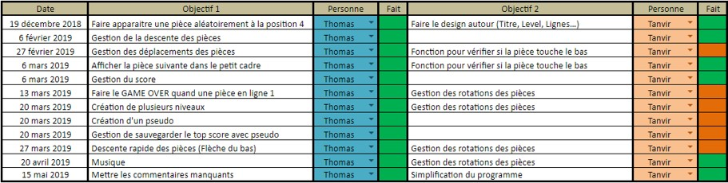

# Projet de spécialité ISN (Informatique et Science du Numérique) pour le baccalauréat 2019. 
__Membres du groupe:__  
- Tanvir Uddin 
- Thomas Quentel 

__Le projet:__
Il s'agit d'un Tetris. 
Le projet s'étale sur 6 mois et a abouti sur un 20/20 au baccalauréat de mon côté. Tanvir a eu un peu moins car il avait plus de mal avec la langue française et était très pris par l'administration française tout au long de son année scolaire.  
Cela a été pour moi, en plus d'un projet d'informatique, un apprentissage humain de travailler avec une personne qui vennait d'arriver en France (Tanvir vient du Sri Lanka). 

### Suivi du projet
Le **site internet** du projet est disponible [ici](https://perso.isima.fr/~thquentel/index.html). 
 **Planning Réel:**

